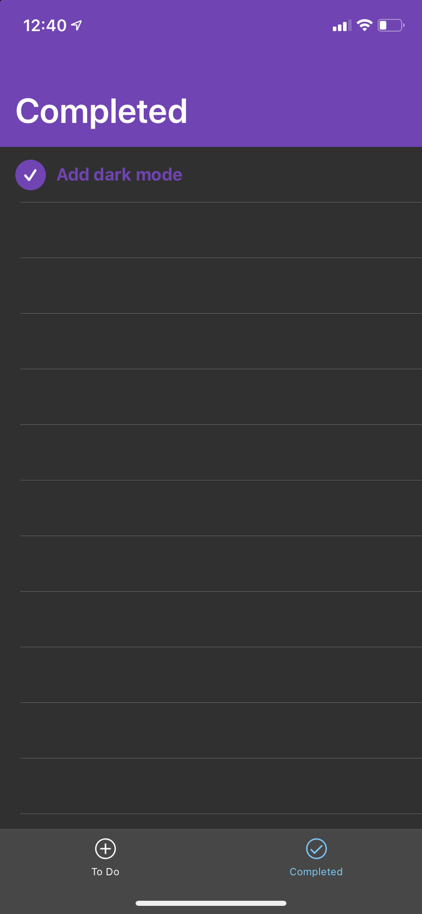

# Listly
A lightweight mobile to-do list app. Built with Vue.js using the NativeScript framework and fully integrates iOS style menus.

### Install
This project is a work in progress, and when complete, will be published on the app store. For now, it can be previewed on a mobile device using the NativeScript Playground app.

To do so you'll need the NativeScript CLI. Do `npm install -g nativescript@latest`

Then go to where you cloned this and do `tns preview`

### Usage
The app has two tabs, for active tasks and for completed tasks. Switch between them in the bottom nav bar.

Tap on the circle by an item to move it from todo to completed or vice versa. Tap on an item's name to either move it or delete it.
